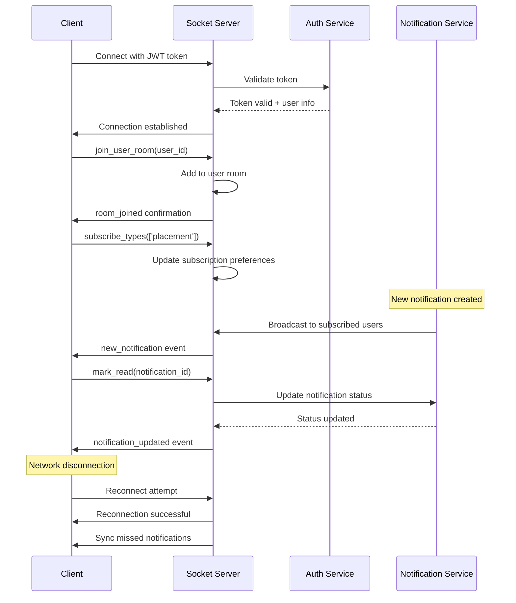
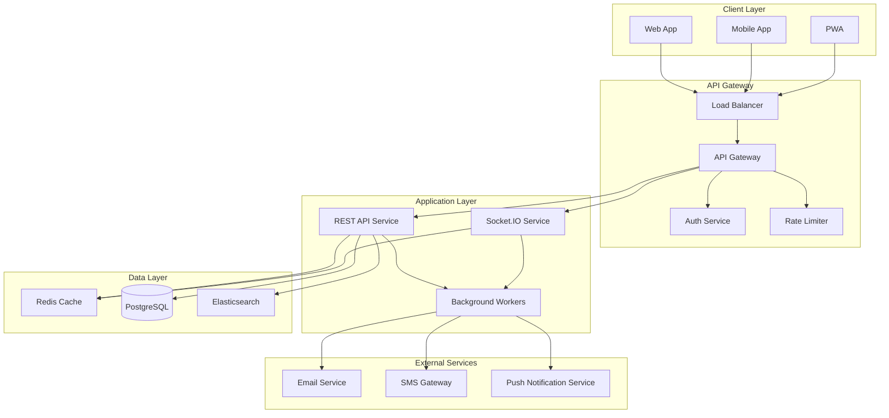
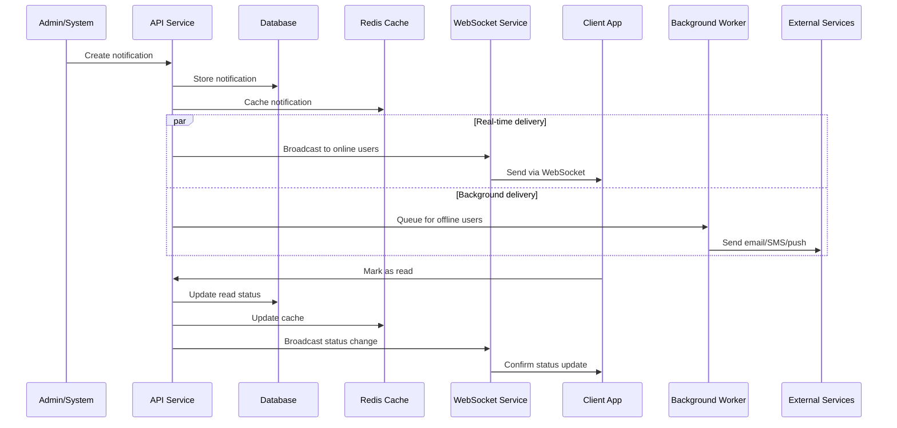
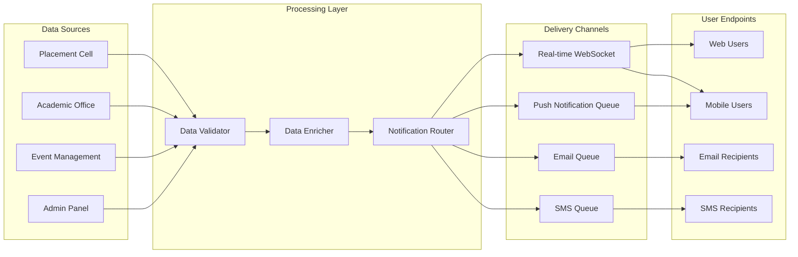
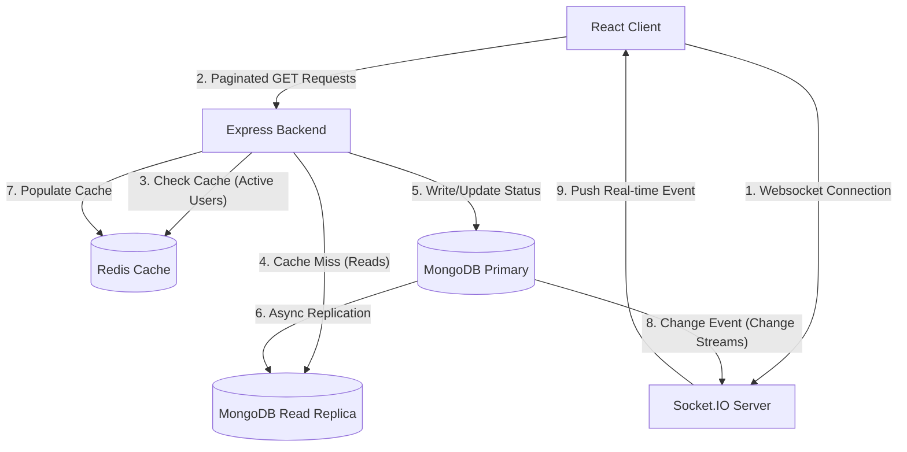

# Notification System Design

## Stage 1

### Overview

This document outlines the design of a production-ready Campus Notification System that enables real-time delivery of Placement, Event, and Result notifications to students. The system is designed for high availability, scalability, and optimal user experience.

---

## Core System Requirements

### Notification Types
- **Placement**: Job opportunities, interview schedules, company visits
- **Event**: Campus events, workshops, seminars, deadlines
- **Result**: Exam results, grade releases, academic announcements
- **General**: Administrative notices, system updates

### Key Features
- Real-time notification delivery
- Read/Unread status tracking
- Bulk operations for administrative efficiency
- Advanced filtering and search capabilities
- Notification statistics and analytics
- Cross-platform support (Web, Mobile)

---

## REST API Specification

### Base URL
```
Production: https://api.campus-notifications.edu
Development: http://localhost:3000/api
```

### Authentication
```http
Authorization: Bearer <jwt_token>
X-User-ID: <student_id>
X-Client-Type: web|mobile
```

**Authentication Assumptions:**
- Users are pre-authorized through campus SSO
- JWT tokens contain user role and permissions
- No registration/login endpoints required
- Token expiry: 24 hours with refresh capability

---

## API Endpoints

### 1. Notifications Management

#### Get All Notifications
```http
GET /notifications
```

**Headers:**
```http
Authorization: Bearer <jwt_token>
Content-Type: application/json
X-User-ID: <student_id>
```

**Query Parameters:**
```
page: integer (default: 1, min: 1)
limit: integer (default: 20, min: 1, max: 100)
type: string (placement|event|result|general)
status: string (read|unread|all) (default: all)
priority: string (low|medium|high|urgent)
sort: string (created_at|updated_at|priority) (default: created_at)
order: string (asc|desc) (default: desc)
search: string (search in title/message)
date_from: ISO8601 datetime
date_to: ISO8601 datetime
```

**Success Response (200):**
```json
{
  "success": true,
  "data": {
    "notifications": [
      {
        "id": "uuid",
        "type": "placement",
        "category": "interview",
        "title": "Google Interview Scheduled",
        "message": "Your technical interview with Google is scheduled for March 15, 2024 at 2:00 PM",
        "priority": "high",
        "status": "unread",
        "metadata": {
          "company": "Google Inc.",
          "location": "Campus Placement Cell",
          "interview_type": "technical",
          "duration": "60 minutes"
        },
        "created_at": "2024-03-10T10:30:00Z",
        "updated_at": "2024-03-10T10:30:00Z",
        "read_at": null,
        "expires_at": "2024-03-15T14:00:00Z"
      }
    ],
    "pagination": {
      "current_page": 1,
      "per_page": 20,
      "total_pages": 5,
      "total_count": 95,
      "has_next": true,
      "has_previous": false
    },
    "filters": {
      "applied": ["type:placement", "status:unread"],
      "available": {
        "types": ["placement", "event", "result", "general"],
        "priorities": ["low", "medium", "high", "urgent"]
      }
    }
  },
  "meta": {
    "request_id": "req_123456789",
    "response_time_ms": 45,
    "timestamp": "2024-03-10T10:30:00Z"
  }
}
```

#### Get Single Notification
```http
GET /notifications/{id}
```

**Path Parameters:**
- `id`: UUID of the notification

**Success Response (200):**
```json
{
  "success": true,
  "data": {
    "notification": {
      "id": "uuid",
      "type": "result",
      "category": "semester_result",
      "title": "Semester 7 Results Published",
      "message": "Your semester 7 examination results are now available for viewing",
      "priority": "medium",
      "status": "unread",
      "metadata": {
        "semester": 7,
        "academic_year": "2023-24",
        "cgpa": 8.45,
        "result_url": "https://results.campus.edu/view/12345"
      },
      "created_at": "2024-03-10T09:00:00Z",
      "updated_at": "2024-03-10T09:00:00Z",
      "read_at": null,
      "expires_at": null
    }
  }
}
```

#### Mark Notification as Read
```http
PUT /notifications/{id}/read
```

**Request Body:**
```json
{
  "read_at": "2024-03-10T10:35:00Z"
}
```

**Success Response (200):**
```json
{
  "success": true,
  "data": {
    "notification": {
      "id": "uuid",
      "status": "read",
      "read_at": "2024-03-10T10:35:00Z",
      "updated_at": "2024-03-10T10:35:00Z"
    }
  },
  "message": "Notification marked as read successfully"
}
```

#### Mark Notification as Unread
```http
PUT /notifications/{id}/unread
```

**Success Response (200):**
```json
{
  "success": true,
  "data": {
    "notification": {
      "id": "uuid",
      "status": "unread",
      "read_at": null,
      "updated_at": "2024-03-10T10:35:00Z"
    }
  },
  "message": "Notification marked as unread successfully"
}
```

### 2. Bulk Operations

#### Bulk Mark as Read
```http
PUT /notifications/bulk/read
```

**Request Body:**
```json
{
  "notification_ids": ["uuid1", "uuid2", "uuid3"],
  "read_at": "2024-03-10T10:35:00Z"
}
```

**Success Response (200):**
```json
{
  "success": true,
  "data": {
    "updated_count": 3,
    "failed_count": 0,
    "updated_notifications": ["uuid1", "uuid2", "uuid3"],
    "failed_notifications": []
  },
  "message": "3 notifications marked as read successfully"
}
```

#### Mark All as Read
```http
PUT /notifications/mark-all-read
```

**Request Body:**
```json
{
  "filters": {
    "type": "placement",
    "priority": "high"
  },
  "read_at": "2024-03-10T10:35:00Z"
}
```

**Success Response (200):**
```json
{
  "success": true,
  "data": {
    "updated_count": 15,
    "message": "All matching notifications marked as read"
  }
}
```

#### Bulk Delete Notifications
```http
DELETE /notifications/bulk
```

**Request Body:**
```json
{
  "notification_ids": ["uuid1", "uuid2", "uuid3"]
}
```

**Success Response (200):**
```json
{
  "success": true,
  "data": {
    "deleted_count": 3,
    "failed_count": 0,
    "deleted_notifications": ["uuid1", "uuid2", "uuid3"]
  }
}
```

### 3. Statistics & Analytics

#### Get Notification Statistics
```http
GET /notifications/stats
```

**Query Parameters:**
```
period: string (today|week|month|year) (default: month)
date_from: ISO8601 datetime
date_to: ISO8601 datetime
```

**Success Response (200):**
```json
{
  "success": true,
  "data": {
    "summary": {
      "total_notifications": 145,
      "unread_count": 12,
      "read_count": 133,
      "read_percentage": 91.72
    },
    "by_type": {
      "placement": {
        "total": 45,
        "unread": 5,
        "read": 40
      },
      "event": {
        "total": 60,
        "unread": 3,
        "read": 57
      },
      "result": {
        "total": 25,
        "unread": 2,
        "read": 23
      },
      "general": {
        "total": 15,
        "unread": 2,
        "read": 13
      }
    },
    "by_priority": {
      "urgent": { "total": 8, "unread": 1 },
      "high": { "total": 32, "unread": 4 },
      "medium": { "total": 78, "unread": 5 },
      "low": { "total": 27, "unread": 2 }
    },
    "timeline": [
      {
        "date": "2024-03-10",
        "received": 5,
        "read": 4
      }
    ]
  }
}
```

#### Get Unread Count
```http
GET /notifications/unread-count
```

**Success Response (200):**
```json
{
  "success": true,
  "data": {
    "total_unread": 12,
    "by_type": {
      "placement": 5,
      "event": 3,
      "result": 2,
      "general": 2
    },
    "by_priority": {
      "urgent": 1,
      "high": 4,
      "medium": 5,
      "low": 2
    }
  }
}
```

### 4. User Preferences

#### Get Notification Preferences
```http
GET /notifications/preferences
```

**Success Response (200):**
```json
{
  "success": true,
  "data": {
    "preferences": {
      "email_notifications": true,
      "push_notifications": true,
      "sms_notifications": false,
      "notification_types": {
        "placement": {
          "enabled": true,
          "priority_threshold": "medium"
        },
        "event": {
          "enabled": true,
          "priority_threshold": "low"
        },
        "result": {
          "enabled": true,
          "priority_threshold": "low"
        },
        "general": {
          "enabled": false,
          "priority_threshold": "high"
        }
      },
      "quiet_hours": {
        "enabled": true,
        "start_time": "22:00",
        "end_time": "08:00",
        "timezone": "Asia/Kolkata"
      }
    }
  }
}
```

#### Update Notification Preferences
```http
PUT /notifications/preferences
```

**Request Body:**
```json
{
  "email_notifications": true,
  "push_notifications": true,
  "notification_types": {
    "placement": {
      "enabled": true,
      "priority_threshold": "high"
    }
  }
}
```

---

## Error Responses

### Standard Error Format
```json
{
  "success": false,
  "error": {
    "code": "VALIDATION_ERROR",
    "message": "Invalid request parameters",
    "details": {
      "field": "page",
      "reason": "Must be a positive integer"
    }
  },
  "meta": {
    "request_id": "req_123456789",
    "timestamp": "2024-03-10T10:30:00Z"
  }
}
```

### HTTP Status Codes

| Status Code | Description | Usage |
|-------------|-------------|-------|
| 200 | OK | Successful GET, PUT requests |
| 201 | Created | Successful POST requests |
| 204 | No Content | Successful DELETE requests |
| 400 | Bad Request | Invalid request parameters |
| 401 | Unauthorized | Missing or invalid authentication |
| 403 | Forbidden | Insufficient permissions |
| 404 | Not Found | Resource doesn't exist |
| 409 | Conflict | Resource already exists |
| 422 | Unprocessable Entity | Validation errors |
| 429 | Too Many Requests | Rate limit exceeded |
| 500 | Internal Server Error | Server-side errors |
| 503 | Service Unavailable | System maintenance |

### Error Codes

| Error Code | Description |
|------------|-------------|
| `VALIDATION_ERROR` | Request validation failed |
| `RESOURCE_NOT_FOUND` | Requested resource not found |
| `AUTHENTICATION_REQUIRED` | Valid authentication required |
| `INSUFFICIENT_PERMISSIONS` | User lacks required permissions |
| `RATE_LIMIT_EXCEEDED` | API rate limit exceeded |
| `NOTIFICATION_EXPIRED` | Notification has expired |
| `BULK_OPERATION_FAILED` | Bulk operation partially failed |

---

## Data Schema

### Notification Object
```json
{
  "id": "string (UUID)",
  "type": "string (placement|event|result|general)",
  "category": "string (subcategory within type)",
  "title": "string (max: 200 chars)",
  "message": "string (max: 1000 chars)",
  "priority": "string (low|medium|high|urgent)",
  "status": "string (read|unread)",
  "metadata": "object (type-specific data)",
  "created_at": "string (ISO8601 datetime)",
  "updated_at": "string (ISO8601 datetime)",
  "read_at": "string|null (ISO8601 datetime)",
  "expires_at": "string|null (ISO8601 datetime)"
}
```

### Validation Rules

| Field | Rules |
|-------|-------|
| `type` | Required, enum: placement\|event\|result\|general |
| `title` | Required, string, max: 200 characters |
| `message` | Required, string, max: 1000 characters |
| `priority` | Required, enum: low\|medium\|high\|urgent |
| `metadata` | Optional, valid JSON object |
| `expires_at` | Optional, future datetime |

---

## Real-time Notifications (WebSocket/Socket.IO)

### WebSocket Connection

**Connection URL:**
```
wss://api.campus-notifications.edu/socket.io/
```

**Authentication:**
```javascript
const socket = io('wss://api.campus-notifications.edu', {
  auth: {
    token: 'jwt_token',
    user_id: 'student_id'
  },
  transports: ['websocket', 'polling']
});
```

### Socket Events

#### Client → Server Events

##### Join User Room
```javascript
socket.emit('join_user_room', {
  user_id: 'student_123',
  client_type: 'web'
});
```

##### Subscribe to Notification Types
```javascript
socket.emit('subscribe_types', {
  types: ['placement', 'result'],
  priority_threshold: 'medium'
});
```

##### Mark Notification as Read (Real-time)
```javascript
socket.emit('mark_read', {
  notification_id: 'uuid',
  read_at: '2024-03-10T10:35:00Z'
});
```

#### Server → Client Events

##### New Notification
```javascript
socket.on('new_notification', (data) => {
  // data contains full notification object
  console.log('New notification:', data.notification);
});
```

##### Notification Updated
```javascript
socket.on('notification_updated', (data) => {
  console.log('Notification updated:', data.notification);
});
```

##### Bulk Update
```javascript
socket.on('bulk_update', (data) => {
  console.log('Bulk operation completed:', data.summary);
});
```

##### Connection Status
```javascript
socket.on('connect', () => {
  console.log('Connected to notification server');
});

socket.on('disconnect', (reason) => {
  console.log('Disconnected:', reason);
});

socket.on('reconnect', (attemptNumber) => {
  console.log('Reconnected after', attemptNumber, 'attempts');
});
```

### WebSocket Connection Lifecycle



---

## System Architecture

### High-Level Architecture



### Notification Flow Sequence



### Data Flow Architecture



---

## Performance Specifications

### Response Time Requirements
- **GET /notifications**: < 200ms (95th percentile)
- **WebSocket message delivery**: < 100ms
- **Bulk operations**: < 2s for 1000 notifications
- **Search operations**: < 300ms

### Scalability Requirements
- **Concurrent WebSocket connections**: 10,000+
- **API requests per second**: 1,000+
- **Notification throughput**: 50,000/hour
- **Database queries**: < 50ms average

### Availability Requirements
- **System uptime**: 99.9%
- **WebSocket connection success rate**: 99.5%
- **Data consistency**: Eventually consistent (< 5s)

---

## Security Considerations

### Authentication & Authorization
- JWT-based authentication with 24-hour expiry
- Role-based access control (Student, Admin, Faculty)
- API rate limiting: 100 requests/minute per user
- WebSocket connection authentication

### Data Protection
- All API communications over HTTPS/WSS
- Input validation and sanitization
- SQL injection protection via parameterized queries
- XSS protection with content security policies

### Privacy Controls
- User-controlled notification preferences
- Data retention policies (notifications expire after 1 year)
- GDPR compliance for data export/deletion
- Audit logging for all user actions

---

*This completes the Stage 1 notification system design specification.*

---

## Stage 3 - Database Indexing & Query Optimization

### 1. Query Accuracy Analysis
The provided query is:
```sql
SELECT *
FROM notifications
WHERE studentID = 1042
AND isRead = false
ORDER BY createdAt ASC;
```

- **Accuracy**: The query is **syntactically and logically correct** for retrieving all unread notifications of student `1042` sorted in ascending order of their creation date.
- **Production Anti-Pattern (`SELECT *`)**: Using `SELECT *` in production is a bad practice. It retrieves all columns, which increases network payload and prevents the database from utilizing an **index-only scan (covering index)**. It should be refactored to fetch only required columns:
  ```sql
  SELECT id, title, message, createdAt 
  FROM notifications
  WHERE studentID = 1042 AND isRead = false
  ORDER BY createdAt ASC;
  ```

### 2. Performance Bottleneck (Why it is slow)
Given the table contains **5,000,000 notifications** and **50,000 students**:
- **Sequential Table Scan**: Without a proper index, the database engine must scan all 5,000,000 rows sequentially ($O(N)$ time complexity) to check which rows match the filters `studentID = 1042` and `isRead = false`.
- **In-Memory Sort (Filesort)**: The database also has to sort the matched records by `createdAt`. Without an index that naturally provides this sorting order, the database must perform an expensive in-memory sort (**Filesort**), which has a time complexity of $O(M \log M)$ (where $M$ is the number of matched records). This consumes substantial CPU and memory.

### 3. Recommended Optimization (The Ideal Index)
We should create a **composite (multi-column) index** tailored specifically to this query's filters and sorting order.

#### Index Definition
```sql
CREATE INDEX idx_notifications_student_unread_created 
ON notifications (studentID, isRead, createdAt ASC);
```

#### Selection and Order Rationale (Equality-Sort Rule)
The order of columns in a composite index is critical:
1. **`studentID` (First - High Cardinality Equality)**: It narrows down the search space immediately from 5,000,000 records to a tiny fraction belonging to the specific student (high selectivity).
2. **`isRead` (Second - Low Cardinality Equality)**: Further filters the subset to only unread notifications.
3. **`createdAt ASC` (Third - Sort Column)**: By placing the sort column at the end, the index entries are already stored in the requested sorting order. This completely eliminates the need for the database engine to perform a **Filesort** step.

### 4. Why Indexing Every Column is a Bad Idea
A developer's suggestion to index every single column individually to "be safe" is counterproductive:
- **Write Overhead (DML Degradation)**: Every insert, update, and delete operation requires updating the corresponding indexes. With 5,000,000 rows and high throughput, writes would become extremely slow.
- **Storage and Memory Overhead**: Indexes occupy significant disk space and memory (buffer pool). Too many indexes can exceed the actual data size and push hot data pages out of RAM.
- **Suboptimal Index Choices**: The query optimizer can generally use only one index per table access for a query. Having many single-column indexes increases query planning time and can confuse the query optimizer into choosing a suboptimal index.
- **Inability to Avoid Filesort**: Multiple single-column indexes (e.g., separate indexes on `studentID` and `createdAt`) cannot be combined to satisfy both filtering and sorting in a single lookup.

### 5. Computational Cost Comparison

| Metric | Without Index (Current State) | With Composite Index (Optimized State) |
| :--- | :--- | :--- |
| **Search Time Complexity** | $O(N)$ where $N = 5,000,000$ (Full Table Scan) | $O(\log N + K)$ where $K$ is matched rows (Index Range Scan) |
| **Sort Time Complexity** | $O(M \log M)$ (Requires in-memory Filesort) | $O(1)$ (Index already sorted) |
| **Space Complexity (Aux)** | $O(M)$ for sorting buffer | $O(1)$ |
| **Disk I/O** | Extremely High (reads all pages from disk) | Low (reads only index branch/leaf nodes and matching data blocks) |

### 6. Placement Notification Analysis Query (Last 7 Days)
To find all distinct students who received a `Placement` notification in the last 7 days:

#### Standard/PostgreSQL Query
```sql
SELECT DISTINCT studentID
FROM notifications
WHERE notificationType = 'Placement'
  AND createdAt >= NOW() - INTERVAL '7 days';
```

#### MySQL Alternative
```sql
SELECT DISTINCT studentID
FROM notifications
WHERE notificationType = 'Placement'
  AND createdAt >= DATE_SUB(NOW(), INTERVAL 7 DAY);
```

*(Note: We use `DISTINCT` to avoid duplicate student IDs if a student received multiple placement notifications. The enum value `'Placement'` is case-sensitive as defined in the schema.)*

---

## Stage 4 - System Performance Optimization

### 1. Architectural Overview & Optimized Flow
To resolve the database bottleneck caused by frequent page-load fetches, the system will shift from a naive "fetch everything on page load" design to a multi-tiered, cache-supported, event-driven architecture. 

Below is the optimized system architecture diagram:



---

### 2. Performance Improvement Strategies

#### A. Redis Caching
- **Why it helps**: Most students look at their recent notifications multiple times during a session. Instead of querying MongoDB (disk/index search) every time, we store the recent notifications of active students in Redis (in-memory, $O(1)$ key-value access).
- **Advantages**:
  - Sub-millisecond latency for retrieval.
  - Drastically offloads read traffic from MongoDB, preserving DB CPU.
- **Tradeoffs**:
  - **Cache Invalidation Complexity**: When a notification is marked read or a new one is added, the cache must be updated or invalidated synchronously or via background events.
  - **Memory Usage**: Storing active user data in RAM increases Redis infrastructure cost.

#### B. API Pagination
- **How it helps**: Instead of loading all historical notifications (potentially thousands), the database query limits results to a small batch size (e.g., `limit = 20`).
- **Advantages**:
  - Decreases database scan time and payload size.
  - Lower memory consumption on the backend server and client-side React app.
- **Tradeoffs**:
  - Offset-based pagination (`skip` in MongoDB) becomes slow at very high pages ($O(N)$ scanning). Cursor-based pagination (`_id` or timestamp thresholds) is preferred to maintain constant $O(1)$ lookup performance.

#### C. Infinite Scrolling & Lazy Loading (Frontend UI)
- **Why it helps**: Data is loaded incrementally. When the notification center opens, only the first page (e.g., 10-20 notifications) is fetched. Subsequent pages are fetched only when the user scrolls near the bottom of the list.
- **Advantages**:
  - Improved Initial Page Load (Time to Interactive).
  - Saves bandwidth/DB resources for users who only check their most recent updates.
- **Tradeoffs**:
  - Slightly more complex React state management (tracking scroll thresholds, loading states, and virtualized lists to prevent DOM memory leaks for long lists).

#### D. Socket.IO for Real-Time Updates
- **Why it helps**: Replaces HTTP polling or frequent page-refresh fetches. Socket.IO keeps a persistent TCP connection open; new notifications are pushed instantly to online clients.
- **Advantages**:
  - Eliminates "polling storm" HTTP traffic.
  - Instantaneous updates for active users, improving engagement.
- **Tradeoffs**:
  - Server resources (RAM) are consumed to keep connections open.
  - Scaling Socket.IO horizontally requires a Redis Adapter (Pub/Sub) to sync sockets across multiple server instances.

#### E. MongoDB Read Replicas
- **Why it helps**: Separation of concerns. Writes (e.g., creating notification alerts, updating `isRead` status) are handled by the MongoDB Primary node. Reads (fetching notifications list) are distributed across one or more Secondary Replica nodes.
- **Advantages**:
  - Enables horizontal scaling of read operations.
  - Increases system availability (secondary nodes can be promoted to primary on failure).
- **Tradeoffs**:
  - **Eventual Consistency**: Replication lag between primary and secondary nodes can cause a short delay, where a student marks a notification as read, but it still shows as unread on a quick refresh.

#### F. Connection Pooling
- **Why it helps**: Mongoose/MongoDB maintains a pool of pre-established TCP connections. Instead of opening a new TCP connection (which requires authentication and 3-way handshakes) for every request, connection pooling reuses existing ones.
- **Advantages**:
  - Eliminates TCP handshake overhead for database calls.
  - Prevents the database from hitting connection limits (file descriptors exhaust).
- **Tradeoffs**:
  - If pool size is misconfigured (too small), requests will queue up; if too large, it wastes DB server memory.

#### G. API & Payload Optimization
- **Why it helps**:
  1. **Projection**: Select only necessary fields (e.g., `_id`, `title`, `type`, `createdAt`, `isRead`) in the MongoDB query, leaving out heavy metadata objects until a single notification is viewed.
  2. **Gzip/Brotli Compression**: Compress backend JSON payloads before sending them over the network.
  3. **HTTP Caching**: Use `ETag` or `Cache-Control: private, max-age=60` for caching notifications on the user's browser client if they are unaltered.
- **Advantages**:
  - Greatly reduces bandwidth usage and response payload serialization time.
  - Browser caching eliminates repeated backend calls for identical data.
- **Tradeoffs**:
  - Data projection means the client must make an additional API request (e.g., `GET /notifications/:id`) to retrieve full metadata when clicking on a notification card.